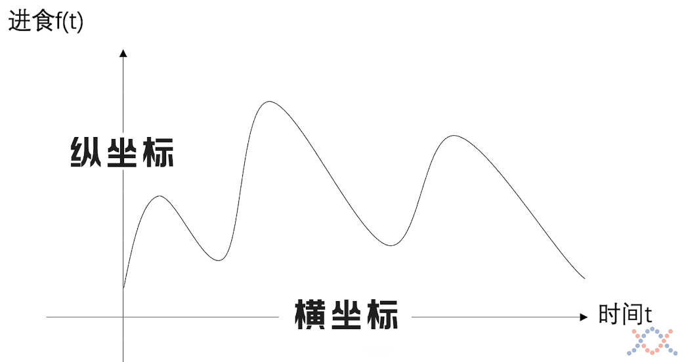
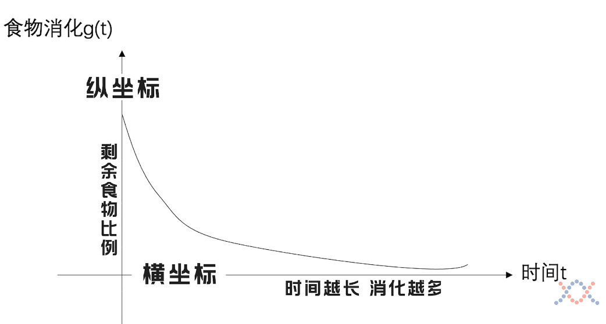
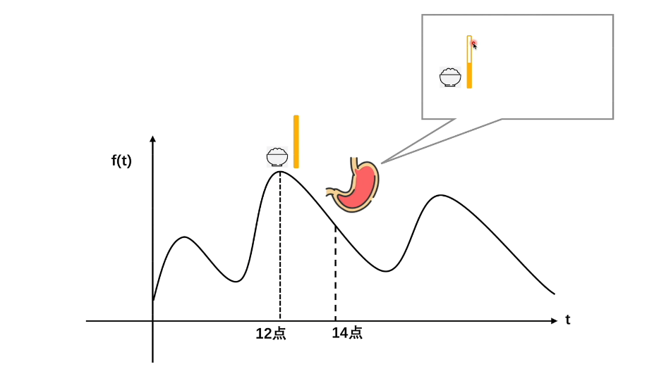
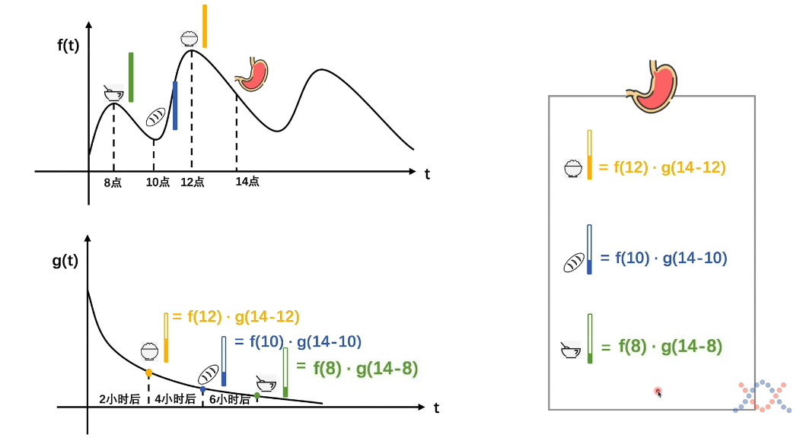
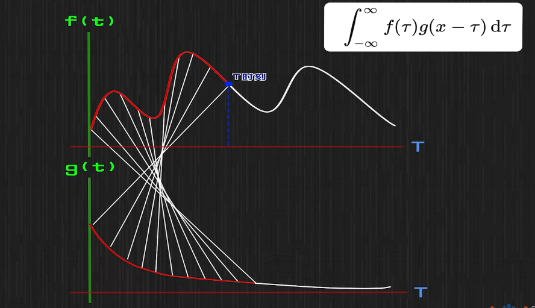
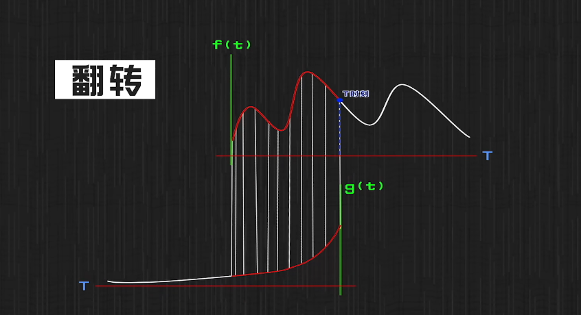
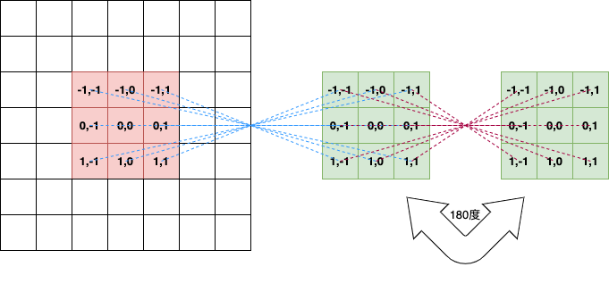
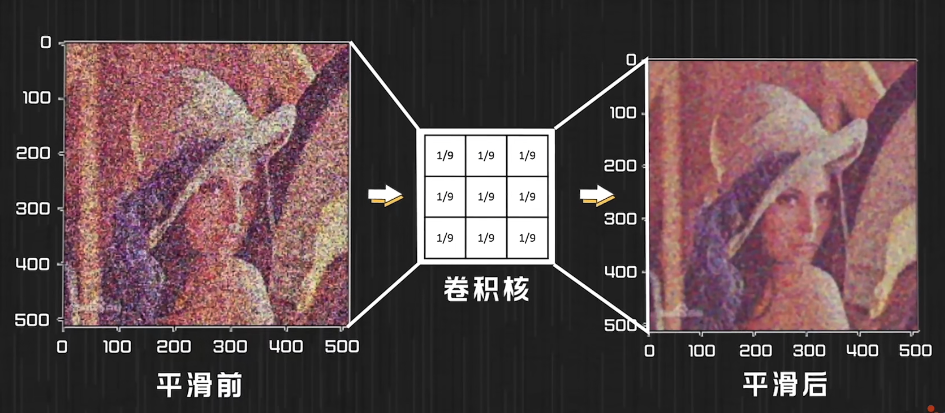
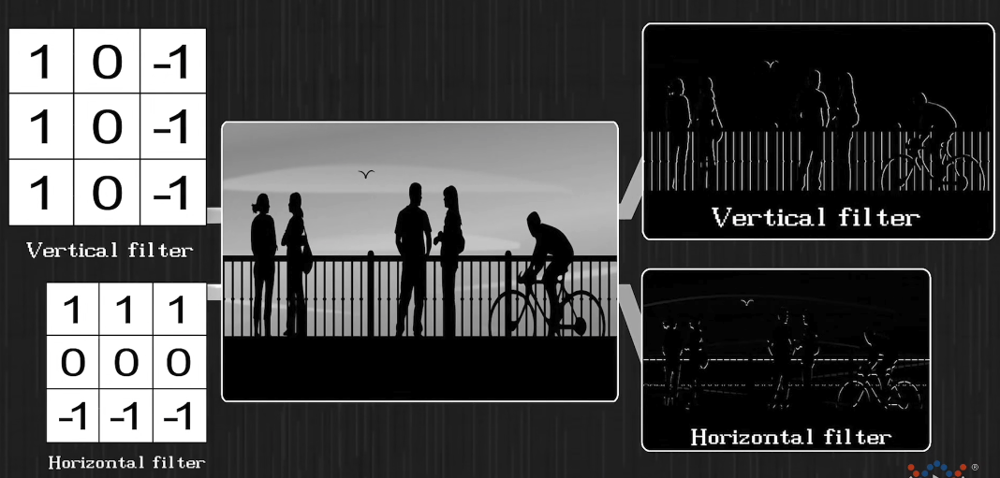

# AI Theory

## 卷积

1. 卷积公式

    * 一维卷积公式
    $$\displaystyle \int^{\infty}_{-\infty}{f(\tau)g(x-\tau)d\tau}$$
    * 二维卷积公式
    $$\displaystyle \sum_{\mu=-k}^k\sum_{\nu=-k}^kf[i - \mu, j - \nu]g[\mu,\nu]$$

2. 卷积的物理意义

    一维卷积物理意义

    | P1 | P2 |
    |:------:|:------:|
    |||
    |||
    |||

    二维卷积物理意义

    

3. 特征提取

    * 平滑卷积核
    
    * 过滤器（特征提取）
    

## 链式法则

## 正向传播

## 反向传播

## 梯度

## CNN
