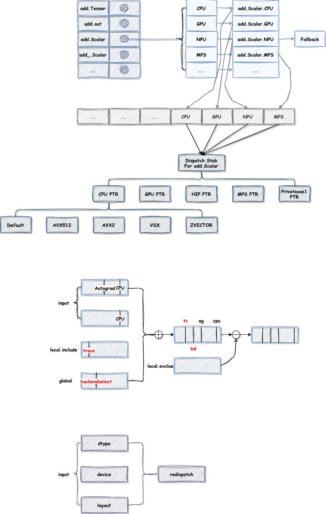

# The Implementation of Dispatcher

## DispatchKey

```text
DispatchKey: uint16_t (total 132)
1) Functionality Key
    a) non-customizable functionalities
    b) customizable per backend
2) per-backend instances of customizable functionalities
3) alias key

non-customizable functionalities(46):
    BackendSelect
    Python
    ADInplaceOrView
    VmapMode

    // TODO: make Autocast a functionality key
    AutocastCPU
    AutocastXPU
    AutocastIPU
    AutocastHPU
    AutocastXLA
    AutocastCUDA
    AutocastPrivateUse1

customizable per backend(5):
    Dense
    Quantized
    Sparse
    NestedTensor
    Autograd

per-backend instances of customizable functionalities(15):
    CPU
    CUDA
    HIP
    XLA
    MPS
    IPU
    XPU
    HPU
    VE
    Lazy
    MTIA
    PrivateUse1
    PrivateUse2
    PrivateUse3
    Meta

alias key(8):
    Autograd
    CompositeImplicitAutograd
    CompositeExplicitAutograd
```

## DispatchKeySet

## Dispatcher


